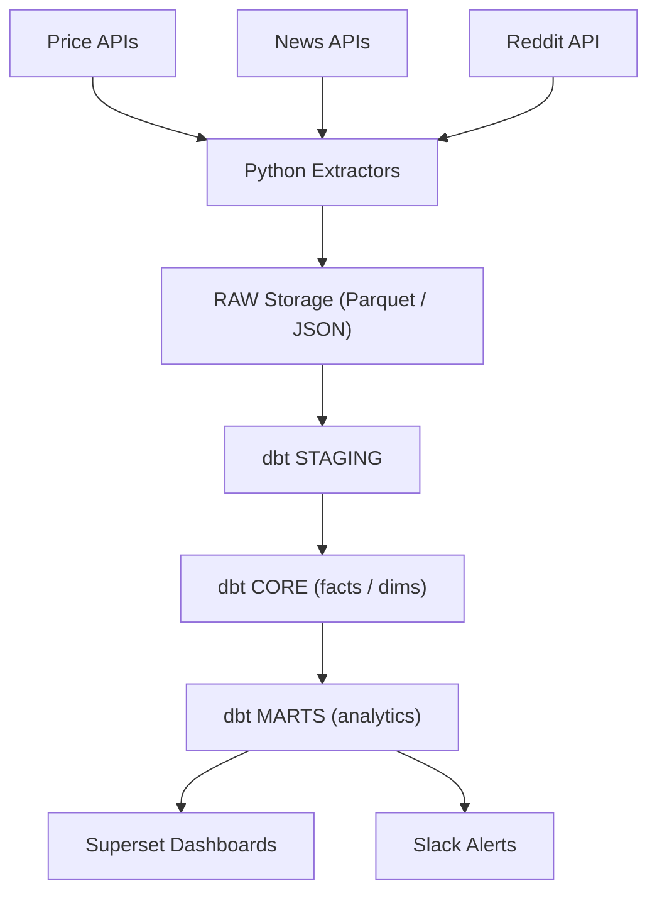

# Stocks + News + Sentiment — Data Platform

An open-source, production-style data platform that ingests **market prices**, **news**, and optional **social posts**, scores **sentiment** (FinBERT/VADER), models data with **dbt**, schedules with **Airflow**, and serves analytics via **Superset**

## Features
- Automated pipelines (daily prices; hourly news/social deltas)
- NLP sentiment scoring (FinBERT for headlines, VADER for social)
- dbt models: `fact_price`, `fact_news`, `mart_sentiment_trend`, `mart_event_study`
- Dashboards: sentiment vs price, event study, source mix
- Slack alerts on spikes & data-quality failures

## Stack
**Ingestion:** Python extractors \
**Warehouse:** Postgres (prod) / DuckDB (CI)\
**Transforms:** dbt \
**Orchestration:** Airflow \
**NLP:** FinBERT, VADER\
**BI:** Apache Superset\
**CI:** GitHub Actions 

## Architechture

## Repo Layout (initial)

stocks-news-sentiment/
├── README.md               # project overview
├── airflow/                # Airflow DAGs (next commit)
│   └── dags/
├── ingestion/              # Python extractors (next commit)
│   ├── extract_prices.py
│   ├── extract_news.py
│   └── score_news.py
├── sentiment/              # NLP models (next commit)
│   ├── finbert.py
│   └── vader.py
├── warehouse/              # dbt project (next commit)
│   ├── dbt_project.yml
│   ├── profiles.yml
│   └── models/
│       ├── staging/
│       ├── core/
│       └── marts/
├── dashboards/             # Superset exports (later)
│   └── superset_export.json
└── docs/                   # architecture, data dictionary, runbook
    ├── architecture.md
    ├── data_dictionary.md
    ├── runbook.md
    └── decisions.md

## Roadmap
- Docker compose (Postgres, Airflow, dbt, Streamlit)
- Price + News extractors (placeholders → real APIs)
- FinBERT/VADER scoring service
- dbt models + tests + freshness
- Dashboards (3 MVP charts)
- Optional FastAPI signals endpoint
