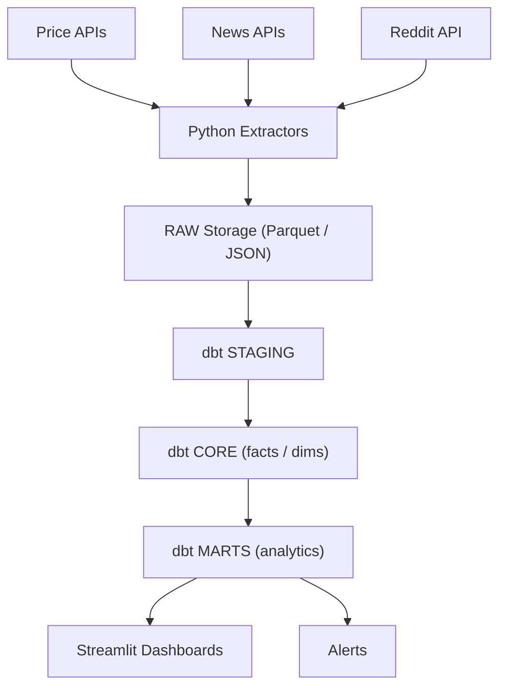

# Stocks + News + Sentiment — Data Platform

An open-source, production-style data platform that ingests **market prices**, **news**, and optional **social posts**, scores **sentiment** (FinBERT/VADER), models data with **dbt**, schedules with **Airflow**, and serves analytics via **Streamlit**

## Features
- Automated pipelines (daily prices; hourly news/social deltas)
- NLP sentiment scoring (FinBERT for headlines, VADER for social)
- dbt models: `fact_price`, `fact_news`, `mart_sentiment_trend`, `mart_event_study`
- Dashboards: sentiment vs price, event study, source mix


## Stack
**Ingestion:** Python extractors \
**Warehouse:** Postgres (prod) \
**Transforms:** dbt \
**Orchestration:** Airflow \
**NLP:** FinBERT, VADER\
**BI:** Streamlit\

## Architechture



## DB Schema (Initial)
```erDiagram
  DIM_TICKER ||--o{ FACT_PRICE : "by symbol_id"
  DIM_TICKER ||--o{ FACT_NEWS : "by symbol_id"
  DIM_TICKER ||--o{ FACT_SOCIAL_MESSAGE : "by symbol_id"

  DIM_CALENDAR ||--o{ FACT_PRICE : "by date_key"
  DIM_CALENDAR ||--o{ FACT_NEWS : "by date_key"
  DIM_CALENDAR ||--o{ FACT_SOCIAL_MESSAGE : "by date_key"

  DIM_SOURCE ||--o{ FACT_NEWS : "published_by"
  DIM_SOURCE ||--o{ FACT_SOCIAL_MESSAGE : "from_platform"

  FACT_NEWS ||--o{ MART_EVENT_STUDY : "joined to fwd returns"
  FACT_NEWS ||--o{ MART_SENTIMENT_TREND : "aggregated daily"
  FACT_SOCIAL_MESSAGE ||--o{ MART_SENTIMENT_TREND : "aggregated daily"

  DIM_TICKER {
    int symbol_id PK
    string ticker UK
    string name
    string sector
    string exchange
    boolean is_active
  }

  DIM_CALENDAR {
    int date_key PK  "YYYYMMDD"
    date d
    boolean is_trading_day
    int year
    int month
    int day
    int dow
  }

  DIM_SOURCE {
    int source_id PK
    string provider   "polygon|finnhub|reddit"
    string name       "publisher/subreddit"
  }

  FACT_PRICE {
    int symbol_id FK
    int date_key  FK
    numeric open
    numeric high
    numeric low
    numeric close
    numeric adj_close
    bigint volume
    string uk UK "symbol_id-date_key"
  }

  FACT_NEWS {
    uuid news_id PK
    int symbol_id FK
    int date_key  FK
    timestamptz published_ts
    string headline
    string summary
    string url
    string provider         "polygon|finnhub"
    string source           "publisher"
    numeric provider_sentiment
    numeric model_sentiment "FinBERT (pos-neg)"
    string model_label      "pos|neu|neg"
    string article_id UK    "provider article id"
  }

  FACT_SOCIAL_MESSAGE {
    uuid message_id PK
    int symbol_id FK
    int date_key  FK
    timestamptz created_ts
    string platform         "reddit"
    string source           "subreddit/user"
    text   text
    int    upvotes
    numeric model_sentiment "VADER compound"
    string model_label      "pos|neu|neg"
  }

  MART_SENTIMENT_TREND {
    int symbol_id
    int date_key
    numeric daily_news_sent
    int news_count
    numeric reddit_avg
    int reddit_count
    numeric sent_7d
    numeric sent_21d
    numeric reddit_z
  }

  MART_EVENT_STUDY {
    uuid news_id
    int symbol_id
    int d
    numeric fwd_ret_1d
    numeric fwd_ret_3d
    numeric fwd_ret_5d
    numeric model_sentiment
  }
```


## Roadmap
- Docker compose (Postgres, Airflow, dbt, Streamlit)
- Price + News extractors (placeholders → real APIs)
- FinBERT/VADER scoring service
- dbt models + tests + freshness
- Dashboards (3 MVP charts)
- Optional FastAPI signals endpoint
